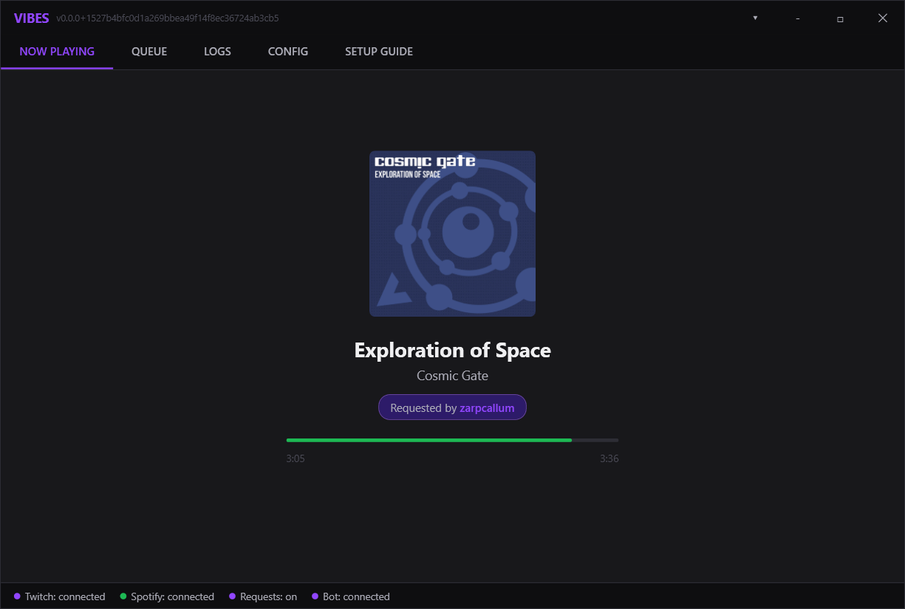

# Vibes



A Twitch song request manager for Spotify. Viewers request songs via chat commands or channel point redemptions, and they get queued directly into your Spotify playback.

## Features

- **Song requests** via chat command (`!sr`) or channel point reward
- **Now playing** display with album art, progress bar, and requester badge
- **Queue view** showing upcoming tracks with requesters
- **Chat commands** - `!song`, `!queue`, `!pos`, `!remove`, `!skip`, `!voteskip`, `!like`, and more
- **Bot account support** - send responses from a separate bot account
- **Per-user limits** - max requests per user level (viewer, sub, VIP, mod, etc.)
- **Explicit filter**, song length cap, queue length cap
- **Spotify URLs and URIs** accepted as song requests
- Minimize to tray, auto-connect on startup

## Setup

### Spotify

1. Go to [developer.spotify.com](https://developer.spotify.com/dashboard) and create an app
2. Set the redirect URI to `http://127.0.0.1:8888/callback/`
3. Copy the Client ID and Client Secret into Vibes → Config → Spotify
4. Click **Connect Spotify** - authorize in the browser

### Twitch

1. Click **Connect Twitch** - a browser window will open for authorization
2. Optionally authorize a **bot account** separately via the Authorize Bot button
3. Enter your channel name and (if using a bot) the bot's account name

## Chat Commands

| Command | Description | Default |
|---------|-------------|---------|
| `!sr <song>` | Request a song | enabled |
| `!song` | Show now playing | enabled |
| `!queue` | Show upcoming queue | enabled |
| `!next` | Show next song | enabled |
| `!pos` | Your position in queue | disabled |
| `!remove` | Remove your request | disabled |
| `!skip` | Skip current song (mod) | disabled |
| `!voteskip` | Vote to skip | disabled |
| `!like` | Like current song | disabled |
| `!togglesr` | Toggle requests on/off (mod) | disabled |

All triggers are configurable in Config → Commands.

## Building

```bat
publish.bat 1.0.0
```

Output: `publish/Vibes.exe`

## Requirements

- Windows 10/11
- Spotify Premium (required for queue control)
